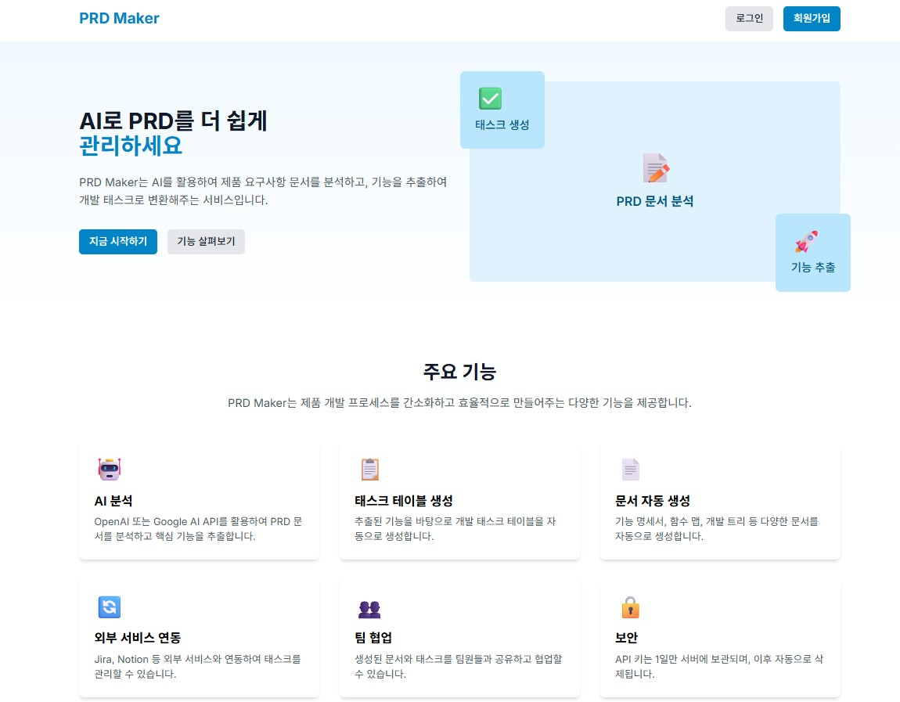

<div></div>

# PRD Maker (제품 요구사항 문서 생성기)

PRD Maker는 AI를 활용하여 제품 요구사항 문서를 분석하고, 기능을 추출하여 개발 태스크로 변환해주는 웹 서비스입니다. OpenAI 또는 Google AI API를 사용하여 PRD 문서를 분석하고 개발에 필요한 다양한 문서를 자동으로 생성합니다.

## 주요 기능

- 사용자 인증 (이메일 기반 Supabase Auth)
- AI API 키 관리 (OpenAI, Google AI 지원 및 언제든지 변경 가능)
- PRD 분석 및 기능 추출 (AI 기반 자동 분석)
- 태스크 테이블 생성 (기능별 작업 목록)
- 함수 맵, 개발 트리, 시스템 구성 등 문서 자동 생성
- 프로젝트 관리 (여러 PRD 프로젝트 생성 및 관리)

## 기술 스택

- **프론트엔드**: Next.js 14, React 18, Tailwind CSS
- **백엔드**: Supabase (인증, 데이터베이스, 스토리지)
- **AI API**: OpenAI GPT-4, Google Gemini Pro
- **외부 연동 예정**: Jira API, Notion API

## 시작하기

### 사전 요구사항

- Node.js 18.0.0 이상 (권장: Node.js 20.x)
- npm 또는 yarn
- Supabase 계정
- OpenAI API 키 또는 Google AI API 키

### 설치 방법

1. 저장소 클론

```bash
git clone https://github.com/jinyounghwa/prdmaker.git
cd prdmaker
```

2. 의존성 설치

```bash
npm install
```

3. 환경 변수 설정

`.env.local` 파일을 생성하고 다음 내용을 추가합니다:

```
NEXT_PUBLIC_SUPABASE_URL=your-supabase-url
NEXT_PUBLIC_SUPABASE_ANON_KEY=your-supabase-anon-key
NEXT_PUBLIC_APP_URL=http://localhost:3000
```

4. 개발 서버 실행

```bash
npm run dev
```

5. 브라우저에서 `http://localhost:3000` 접속

## 사용 방법

1. 회원가입 및 로그인
2. 새 프로젝트 생성
3. AI API 키 입력 (OpenAI 또는 Google AI)
4. PRD 텍스트 입력 및 분석
5. 추출된 기능 확인
6. 태스크 테이블, 함수 맵, 개발 트리, 시스템 구성 등 문서 생성

## 데이터베이스 구조

- **users**: 사용자 정보
- **projects**: 프로젝트 정보
- **api_keys**: AI API 키 (1일 보관)
- **prd_documents**: PRD 문서
- **features**: 추출된 기능
- **tasks**: 태스크 정보
- **generated_documents**: 생성된 문서
- **integrations**: 외부 서비스 연동 정보

## 보안 사항
- AI API키는 유료 모델에 대한 요청만 가능합니다. 무료 모델은 사용할 수 없습니다.
- API 키는 1일만 서버에 보관되며, 이후 자동으로 삭제됩니다.
- 모든 데이터는 Row Level Security를 통해 보호됩니다.
- 사용자는 자신의 데이터만 접근할 수 있습니다.
- 사용자는 언제든지 AI API 제공자를 변경할 수 있습니다.

## 라이선스

MIT License
